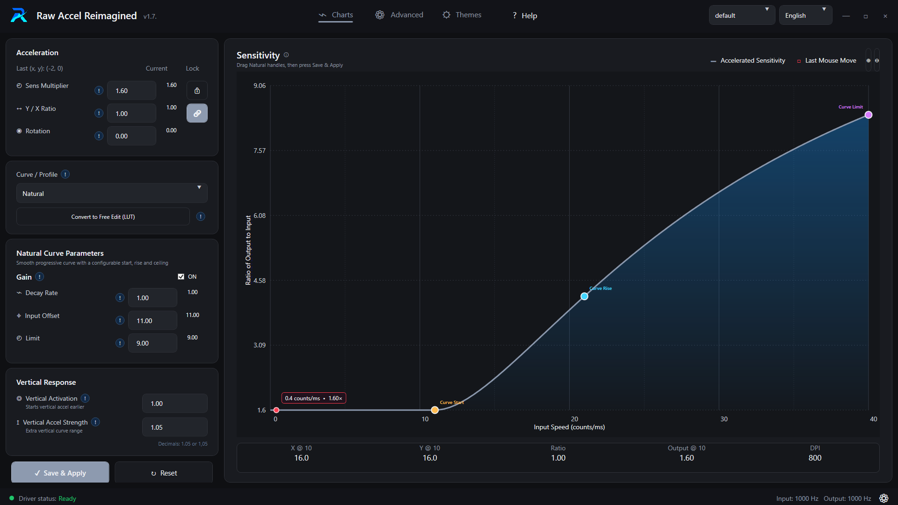
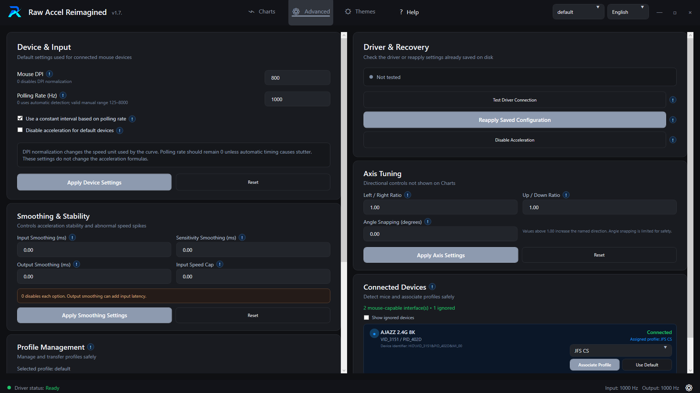

<p align="center">
  
</p>

# Raw Accel Reimagined

**A modern, bilingual, and profile-oriented interface for the Raw Accel driver.**

### [Visit the official website](https://diskcell.github.io/Raw-Accel-Reimagined/)

Raw Accel Reimagined preserves the original acceleration engine while providing a redesigned experience for configuring, visualizing, and managing mouse acceleration on Windows.

## Preview

### Charts and interactive curve editor

<p align="center">
  
</p>

### Advanced controls, profiles, and connected devices

<p align="center">
  
</p>

## Highlights

- Modern WPF interface with multiple persistent themes and a live acceleration graph.
- Complete English and Brazilian Portuguese localization.
- Interactive curve editing with draggable Natural curve handles.
- Free Edit mode that converts Natural, Classic, Jump, Synchronous, and Power curves into editable LUT points.
- Profiles that can be created, duplicated, renamed, deleted, imported, exported, and safely associated with detected mouse devices.
- Controls for vertical response, axis tuning, device input, smoothing, stability, and driver recovery.
- Contextual help for configuration options directly inside the application.
- Windows system tray support and explicit acceleration shutdown when exiting.
- Built-in, bilingual update checks with verified GitHub Release downloads and settings-safe installation.

## Website

- Main website: [diskcell.github.io/Raw-Accel-Reimagined](https://diskcell.github.io/Raw-Accel-Reimagined/)
- English version: [diskcell.github.io/Raw-Accel-Reimagined/en](https://diskcell.github.io/Raw-Accel-Reimagined/en/)

## Automatic updates

Starting with version 1.8.0, Raw Accel Reimagined can check GitHub Releases automatically. When an update is available, the application asks for confirmation, downloads the official Windows package, verifies its SHA-256 checksum, installs it, and reopens itself.

`settings.json`, `.config`, `.reimagined.config`, profiles, themes, language preferences, and local device associations are preserved during the update. Automatic checks can be enabled or disabled on the Themes page, where updates can also be checked manually.

Users of versions older than 1.8.0 must install version 1.8.0 manually once. Future published versions can then be installed from inside the application.

## Run

1. Copy `settings.example.json` to `settings.json` in the project root.
2. Install the driver with `installer.exe` if it is not installed yet.
3. Run `RawAccelReimagined.exe`.

Personal settings, local preferences, and hardware identifiers are intentionally excluded from Git to prevent private profiles and device data from being published accidentally.

## Build

Requirements: Windows x64, .NET Framework 4.7.2 Developer Pack, and MSBuild.

```powershell
MSBuild.exe modern-ui\RawAccelModern.csproj /t:Rebuild /p:Configuration=Release /p:Platform=x64
```

The executable is generated at `modern-ui\bin\Release\RawAccelReimagined.exe`.

## Upstream and credits

Raw Accel Reimagined is based on the [original Raw Accel project](https://github.com/a1xd/rawaccel), distributed under the MIT License. The original driver, acceleration formulas, license, and contributor credits are preserved. This repository focuses on the redesigned user interface and its additional configuration and management features.

Original Raw Accel contributors include simon (driver and acceleration logic), \_m00se\_ (GUI, gain features, and acceleration types), Sidiouth, TauntyArmordillo, and Kovaak.

See the original [Guide](doc/Guide.md) and [FAQ](doc/FAQ.md) for more information about Raw Accel.

Maintainers can find the versioning and publication procedure in [Releasing](doc/Releasing.md).
